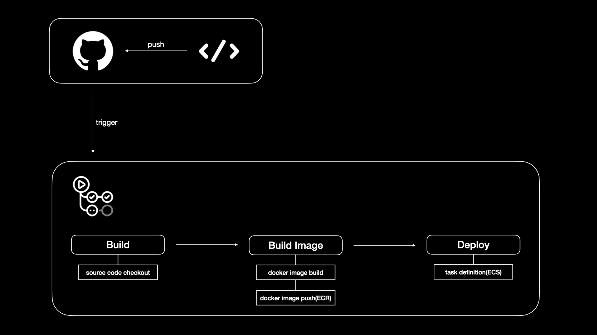

# #{PROJECT_NAME}
<br/>
<br/>
<br/>

Spring Boot 기반 백엔드 템플릿 프로젝트.

## 🧭 Onboarding 빠른 링크

| 상황 | 문서 |
|---|---|
| 새 프로젝트 시작 (테크 리드) | [Part A. 새 프로젝트 부트스트랩](docs/ONBOARDING.md#part-a-새-프로젝트-부트스트랩-1회성) |
| 진행 중인 프로젝트에 합류 | [Part B. 개발자 합류 셋업](docs/ONBOARDING.md#part-b-개발자-합류-셋업) |
| 코드 컨벤션·구조 | [Part C. 코드 컨벤션 & 아키텍처](docs/ONBOARDING.md#part-c-코드-컨벤션--아키텍처) |
| 배포·운영 | [Part D. 배포 & 운영](docs/ONBOARDING.md#part-d-배포--운영) |
| 에러 해결 | [Part E. 트러블슈팅](docs/ONBOARDING.md#part-e-트러블슈팅) |

📖 전체 문서: [docs/ONBOARDING.md](docs/ONBOARDING.md) · GitHub Wiki에도 미러됨

## 🗂️ 디렉토리 구조 (요약)
```
├── .github                     # GitHub Actions workflow + CloudFormation IaC
├── build.gradle                # Gradle 설정
├── docs/                       # 문서 (ONBOARDING 포함)
├── gradle                      # Gradle wrapper
├── README.md
└── src                         # Spring Boot 프로젝트 소스
```

자세한 패키지 구조는 [Part C.1](docs/ONBOARDING.md#c1-패키지-구조) 참조.

## 📋 API Document
Swagger UI: 애플리케이션 실행 후 http://localhost:8080/swagger-ui/index.html

## ⚙️ CI/CD Pipeline


자세한 설명은 [Part D.2](docs/ONBOARDING.md#d2-cicd-파이프라인) 참조.
