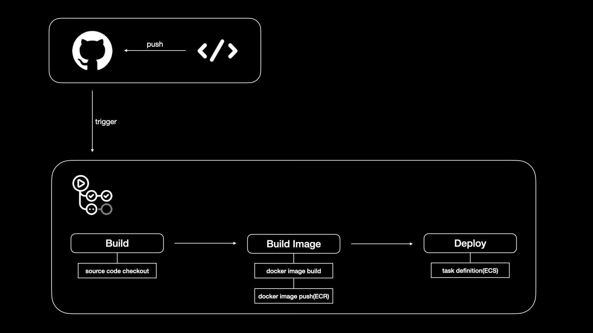

# #{PROJECT_NAME}
<br/>
<br/>
<br/>

## 🗂️ Root Directory Structure
```
├── .github                     # GitHub Actions workflow
├── build.gradle                # Gradle 설정
├── settings.gradle             # 모듈 설정
├── gradle                      # Gradle wrapper
├── README.md                   # 프로젝트 설명
└── src                         # Spring Boot 프로젝트 소스
```

## 📁 Src Directory Structure
```
src
├── main
│   ├── java.com.spring.#{PROJECT_NAME}
│   |   ├── SpringInitApplication.java      # Spring Boot 애플리케이션 시작 클래스
|   |   |
|   |   ├── common                          # 공통 설정 관련 패키지
|   |   │   ├── apidocs                     # API 문서화 관련 설정
|   |   │   ├── aws                         # AWS 관련 설정
|   |   │   ├── base                        # 공통 베이스 클래스
|   |   │   ├── dto                         # 공통 DTO 클래스
|   |   │   ├── exception                   # 공통 예외 처리
|   |   │   ├── healtcheck                  # 헬스 체크 관련 설정
|   |   │   ├── persistence                 # 공통 Persistence 설정
|   |   │   └── security                    # 보안 관련 설정 (SecurityConfig / JWT 등)
|   |   │
|   |   └── domain                          # 도메인 관련 패키지
|   |       ├── controller                  # REST API 컨트롤러
|   |       ├── dto                         # 도메인 DTO 클래스
|   |       ├── entity                      # 도메인 엔티티 클래스
|   |       ├── exception                   # 도메인 예외 처리
|   |       ├── repository                  # 도메인 Repository
|   |       └── service                     # 도메인 서비스 클래스
│   │
│   └── resources
│       └── application.yml                 # 개발 환경 설정
│
└── test.java.com.spring.#{PROJECT_NAME}    # 테스트 코드
```

## 📋 API Document
API 문서는 Swagger를 통해 제공됩니다. <br>
애플리케이션을 실행한 후, 다음 URL에서 확인할 수 있습니다.
- http://localhost:8080/swagger-ui/index.html

## ⚙️ CI/CD Pipeline
